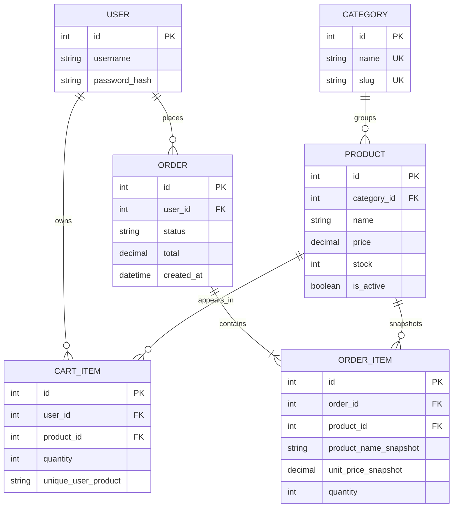

# Entity relationship diagram

Django's built-in `User` table is used for customers and administrator accounts. Order items retain the product name and unit price from checkout so the receipt remains meaningful if catalog details later change.
